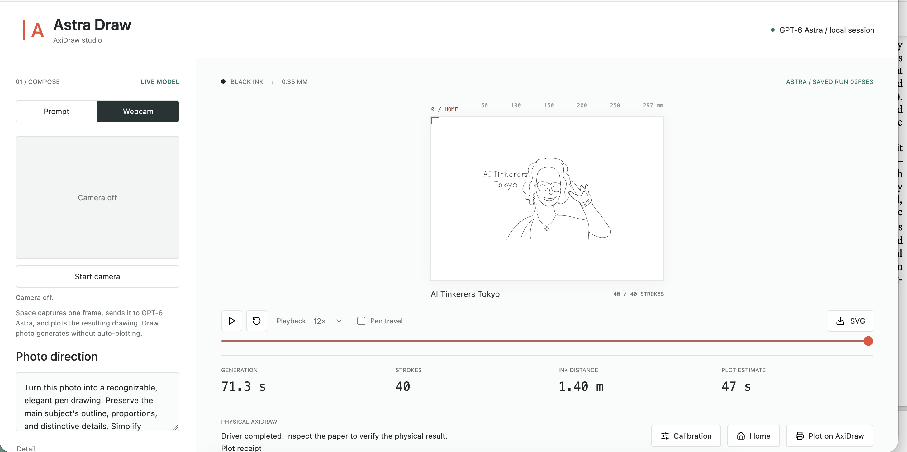
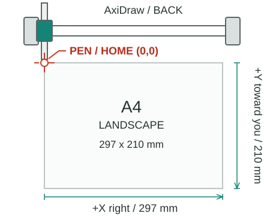

# AxiDraw

A local drawing studio for AxiDraw. Turn prompts or webcam stills into validated pen strokes, preview the path, export SVG, and optionally plot over USB.



This repository contains the standalone app, not a hosted service. Run it on the computer connected to the plotter. Your model credentials, photographs, drawings, and calibration are not transferred by cloning or pulling it.

## Quickstart

Use **Python 3.12 on macOS or Linux** and a browser. The hardware lock uses POSIX APIs; native Windows is not supported by this version. macOS is locally tested; Linux has not been physically tested.

Clone the repository:

```bash
git clone https://github.com/stefania11/AxiDraw.git
cd AxiDraw
python3.12 -m venv .venv
source .venv/bin/activate
python -m pip install -r requirements.txt
```

The repository has a fresh, code-only history. Credentials, private photos, and saved drawings are not included. It starts with an empty gallery.

Complete the one-time [model setup](docs/model-setup.md) on this machine, then start:

```bash
python scripts/astra_studio.py --port 8781
```

Open [Astra Draw](http://127.0.0.1:8781/). Keep the terminal running; press Ctrl-C to stop. If the port is occupied, choose another with `--port 8782` and open the matching URL. No frontend build or Node server is needed; Node is only needed if you install the optional local model runtime through its package manager.

The app opens without an AxiDraw. Actual generation requires access to **`gpt-6-astra`** through your signed-in local runtime or the API backend. It never substitutes sample artwork when a live model call fails. Cloning the repository does not grant model access.

## Connect a Plotter

Install the optional official driver in the same virtual environment:

```bash
python -m pip install -r requirements-plotter.txt
python scripts/astra_studio.py --port 8781 --enable-plotter
```

The driver also provides the offline AxiDraw preview and plot estimate. Without it, drawing generation, animated playback, and SVG export still work. Installation follows the [manufacturer's Python API instructions](https://axidraw.com/doc/py_api/#installation), with an archive checksum pinned in this repository.

- **Plot on AxiDraw** opens a compact confirmation menu. Every drawing raises the pen and returns to an established Home before plotting.
- **Calibration** contains USB selection, speed and pen-height settings, Set Home, and movement tests.
- **Home** returns to the established Home with the pen raised, without drawing.

Before enabling movement, follow [paper placement and calibration](docs/plotter-setup.md). Set Home again after every server restart and whenever physical position is uncertain. The plotter has no physical Home sensor; zero counters do not prove correct physical position.



Artwork is uniformly reduced to 70% of the generated size and centered on A4 landscape (297 x 210 mm). Preview, exported SVG, and physical plotting use the same coordinates. Smaller-than-A4 machines are rejected.

## Webcam

Choose **Webcam**, allow camera access, take a photo, and choose **Draw photo**. Only that still is sent to the model, after you request drawing. Microphone access is disabled, and the camera stops after capture or when leaving photo mode. Use the localhost URL rather than opening the HTML file directly.

For hands-free operation after Home is established, press **Space** while focus is outside a form control or dialog. One press switches to Webcam mode, starts the camera, captures one frame, submits the current photo direction and detail setting to Astra, checks the connected AxiDraw and saved Home, and starts the physical plot. The shortcut is ignored while generation or plotting is active. The first use may require the browser's camera permission; a server restart still requires Home to be set again.

Pressing Space is the operator's instruction to capture and plot. Keep the workspace clear and the physical pause button accessible before using it. The captured JPEG is sent to the model and stored with the ignored run artifacts under `outputs/astra/`.

## Privacy and Local Files

The server binds only to `127.0.0.1` and rejects other hosts/origins. Do not expose it through a public tunnel or bind it to a network interface. It has no remote-user authentication.

`outputs/astra/` holds each machine's prompts, model responses, photographs, SVGs, previews, metrics, and plot receipts. These are ignored by Git, along with environment files, credentials, virtual environments, and caches. The repository starts with an empty gallery. Do not commit private output files manually.

## Updating Another Machine

Stop the server and back up the machine's `outputs/astra/` directory privately. From this clean repository clone, run `git pull --ff-only`, activate the virtual environment, and reinstall the requirements. Restart and establish Home again. Do not push a previous private-data clone or its history to this repository.

For ZIP releases, extract into a new directory, repeat setup, and restore `outputs/astra/` only on your own machine. Never include it when sharing the source.

## Validation

```bash
python -m compileall -q scripts
python -B -m unittest discover -s scripts -p 'test_astra*.py' -v
node --check app/astra/app.js
```

The tests cover geometry, photo validation, local HTTP restrictions, and guarded plotter control using simulated controller responses. Optional driver tests exercise its offline preview with USB blocked. They do not call a model or move hardware and are not model-quality or physical-performance results.

## Troubleshooting

- **Model unavailable:** complete [model setup](docs/model-setup.md) and verify that this machine's account has Astra access. The status badge only checks that a runtime/key exists, not entitlement.
- **Driver unavailable:** activate the same virtual environment used to install `requirements-plotter.txt` before launching.
- **Preview unavailable:** ensure `axicli` is on that environment's `PATH`, or set `AXICLI_PATH` to its executable.
- **USB not detected:** connect directly, close other plotter apps, and check USB/power. On Linux, follow the manufacturer's serial-device permission instructions; do not run the app as root.
- **Home not set:** use Calibration; Send Home cannot establish an unknown physical origin.
- **Dependency checksum changed:** stop and review the vendor release rather than bypassing the hash check.

See [source and third-party notices](NOTICE.md) for provenance.
